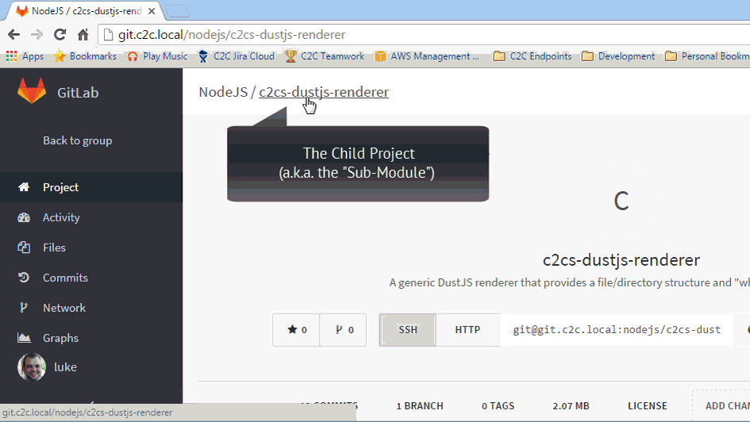

# Linking Repositories

## The Use Case

Sometimes you need to include repositories within other repositories.  This can
be done somewhat easily using Git Submodules.  When you add a submodule to a project
and then set it up in Strider, you might receive an error similar to this one: 

```shell
$ git clone --recursive git@git.c2c.local:docs/c2cs-devwiki-4.git . --branch master gitlab 2.2s -1
Cloning into '.'...
Submodule 'node_modules/c2cs-dustjs-renderer' (git@git.c2c.local:nodejs/c2cs-dustjs-renderer.git) registered for path 'node_modules/c2cs-dustjs-renderer'
Cloning into 'node_modules/c2cs-dustjs-renderer'...
GitLab: The project you were looking for could not be found.
fatal: Could not read from remote repository.

Please make sure you have the correct access rights and the repository exists.
Clone of 'git@git.c2c.local:nodejs/c2cs-dustjs-renderer.git' into submodule path 'node_modules/c2cs-dustjs-renderer' failed
```

In the text above I added the `nodejs/c2cs-dustjs-renderer` project as a submodule
of the `docs/c2cs-devwiki-4` project and the build failed because Strider does
not have access to the `nodejs/c2cs-dustjs-renderer` _within_ the `docs/c2cs-devwiki-4`
build context.

## The Problem

This is caused by the fact that when Strider hooks into GitLab, it provides a unique
public key on a per-project basis.  You can see the key Strider is using by opening
a project in Strider and looking on the main "settings" page (you'll see a section
titled "SSH Keys" there).

So, whenever Strider is pulling the parent project with `--recursive` and it comes
across the submodule, it will try to pull it using the parent project's key.. which
is not connected to the submodule's repository. 

## The Solution

Strider is using a mechanism that GitLab refers to as a "Deploy Key", it is basically
a read-only key for a single project.

What we need to do to fix this is `ENABLE` the parent project's deploy key within
the child project's (submodule) configuration in GitLab. 

* Open GitLab
* Browse to the repository of the "child project" (the one being used as a sub-module)
* Find and click the "Settings" link in the left menu
* Find and click the "Deploy Keys" link in the left menu
* Hit CTRL+F to search for the "Parent" project in the right-most list
* Click the `+ ENABLE` button next to the appropriate key 

After doing that, GitLab should accept the key that Strider is using for the parent
project when it tries to pull the child project as a sub-module. 

#### Demonstration




